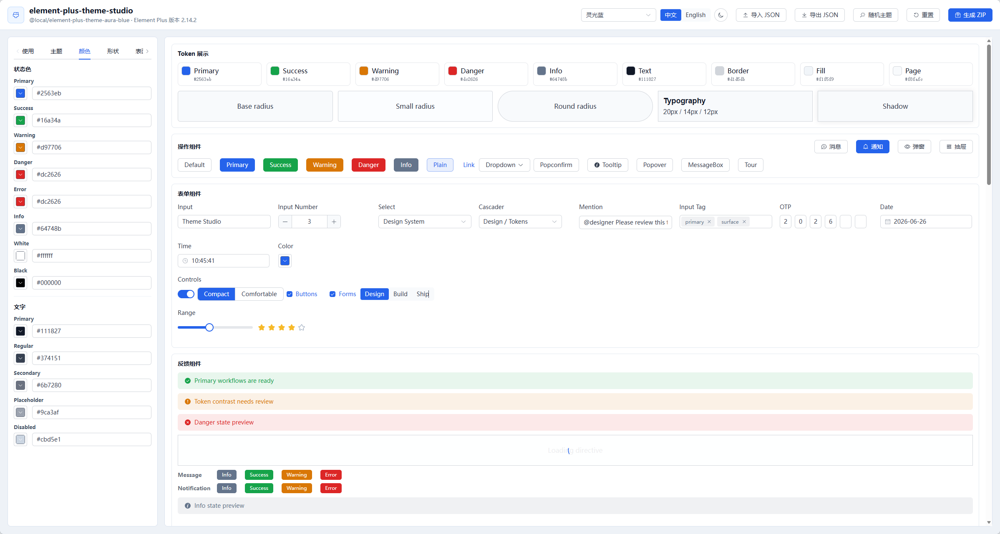

# element-plus-theme-studio

[](https://github.com/Solomemory/element-plus-theme-studio/actions/workflows/ci.yml)


English | [简体中文](./README.zh-CN.md)

Element Plus Theme Studio is a local web tool for visually editing Element Plus themes and generating complete installable theme packages.

It is built for Vue 3, Vite, and Element Plus projects. The app provides token editing, real-time component previews, light and dark mode switching, built-in presets, random theme generation, JSON import/export, and one-click ZIP package generation.

> Built on the official Element Plus `theme-chalk` SCSS variable override workflow. It does not use the legacy Vue 2 Element UI `element-theme` or `element-theme-chalk` toolchain.

## Preview



## Live Demo

- Online preview: [https://solomemory.github.io/element-plus-theme-studio/](https://solomemory.github.io/element-plus-theme-studio/)
- Deploy workflow: [GitHub Actions / Deploy Pages](https://github.com/Solomemory/element-plus-theme-studio/actions/workflows/deploy.yml)

The online preview is a static GitHub Pages deployment. It supports theme editing, presets, random themes, dark mode preview, and JSON import/export. ZIP generation requires the local Node builder, so run `pnpm dev` or `pnpm theme:build` when you need to generate a complete theme package.

First-time GitHub Pages setup:

1. Open [Repository Settings / Pages](https://github.com/Solomemory/element-plus-theme-studio/settings/pages).
2. Set `Build and deployment -> Source` to `GitHub Actions`.
3. Re-run [Deploy Pages](https://github.com/Solomemory/element-plus-theme-studio/actions/workflows/deploy.yml).

If the workflow shows `Get Pages site failed` or `HttpError: Not Found`, the repository has not been enabled for GitHub Pages yet.

## Features

- Visual editing for Element Plus theme tokens: colors, text, borders, backgrounds, radius, shadows, sizes, HTML font size, Sass variables, and CSS overrides
- Token editor tabs for better navigation, with independent scrolling for the editor and preview panes
- Real-time previews for common Element Plus components across forms, actions, feedback, navigation, data display, content, and overlays
- Light and dark theme preview with generated `dark.css`
- Chinese and English UI switching
- Built-in theme presets, including Aura Blue, Glass Aurora, Cupertino Minimal, Data Wall, Neo Brutal, Clay Pop, Soft Neumorph, Mono Editorial, Bento Mint, Flat Candy, Midnight Neon, Phantom Red, Emerald Console, Rose Quartz, Graphite Pro, and Vben Admin
- Random theme generation for fast palette exploration
- JSON import and export for theme source configuration
- Target Element Plus version selection with version-aware `theme-chalk` variable resolution
- Web UI and CLI support for generating complete theme package ZIP files
- Generated packages can be installed directly in Vue 3 + Vite + Element Plus projects

## Tech Stack

| Layer | Stack |
| --- | --- |
| Web app | Vue 3, Vite, TypeScript, Element Plus |
| Theme builder | Node.js, TypeScript, Sass |
| Package output | CSS, SCSS, JSON, README, ZIP |
| Workspace | pnpm workspace |
| ZIP generation | archiver |

## Quick Start

```bash
pnpm install
pnpm dev
```

Open the local URL printed by Vite, usually:

```txt
http://localhost:5173/
```

## How To Use

1. Choose a preset from the top toolbar, or click `Random Theme` to generate a new theme.
2. Edit colors, radius, backgrounds, text, borders, HTML font size, Sass variables, and CSS overrides in the left token panel.
3. Review Element Plus component previews on the right.
4. Toggle light and dark mode from the top toolbar.
5. Click `Export JSON` to save the current theme source configuration.
6. Click `Generate ZIP` to download a complete installable theme package.

## JSON And ZIP

`tokens.json` is the source configuration for a theme. It is useful for saving, reviewing, sharing, versioning, and regenerating theme packages. It is not the final CSS file imported by your application.

`typography.htmlFontSize` controls the generated `html` root font-size and syncs `--studio-root-font-size` / `--studio-html-font-size`. Typography tokens use `rem` in the built-in presets, while `--studio-font-size-base` / `--font-size-base` track `typography.base`.

Recommended sizing strategy:

- Use `htmlFontSize` as the page-level density baseline. Most admin themes should stay at `16px`; display-oriented themes can use `17px`; large-screen dashboards can use `18px`.
- Use `rem` for app layout spacing, page shells, custom typography, and content areas that should scale with the root font-size. Built-in presets use `rem` for `typography.extraLarge`, `typography.large`, `typography.medium`, `typography.base`, `typography.small`, and `typography.extraSmall`.
- Keep Element Plus component geometry tokens such as borders, control heights, icons, and hairline details in `px` unless the product explicitly needs full zoom-like scaling.
- Avoid converting every token to `rem`; it usually makes forms, tables, popups, and mixed third-party components harder to align.

In the web app:

- `Import JSON`: restore a previously exported theme configuration
- `Export JSON`: save the current theme tokens, Sass overrides, CSS overrides, and compatibility options
- `Generate ZIP`: compile Element Plus SCSS and export a complete installable theme package

From the command line:

```bash
pnpm theme:build --tokens examples/aura-blue.json
pnpm theme:build --tokens examples/vben-admin.json
pnpm theme:build --tokens examples/aura-blue.json --element-plus-version 2.13.3
```

Generated output is written to `generated/`.

## Theme Package Usage

The downloaded ZIP contains a package similar to:

```txt
element-plus-theme-custom/
  dist/
    index.css
    dark.css
    tokens.json
    variables.scss
  src/
    index.scss
  package.json
  README.md
```

Install the extracted theme package in your application:

```bash
pnpm add ./path/to/element-plus-theme-custom
```

Import it from your Vue 3 + Vite entry file:

```ts
import { createApp } from 'vue'
import ElementPlus from 'element-plus'
import '@your-scope/element-plus-theme-custom/dist/index.css'
import '@your-scope/element-plus-theme-custom/dist/dark.css'
import App from './App.vue'

createApp(App).use(ElementPlus).mount('#app')
```

`dist/index.css` is a full CSS bundle compiled from Element Plus `theme-chalk`. In most cases you do not need to import `element-plus/dist/index.css` again, otherwise CSS order may override your custom theme.

## Dark Mode

For dark mode, import the official Element Plus dark CSS variables first, then import the generated theme dark override:

```ts
import 'element-plus/theme-chalk/dark/css-vars.css'
import '@your-scope/element-plus-theme-custom/dist/dark.css'
```

Then add the `dark` class to `html`:

```html
<html class="dark">
```

## Element Plus Version Compatibility

By default, the editor uses the currently installed latest Element Plus version. You can also set the target version in the `Element Plus Version` field:

```txt
latest
installed
2.14.2
2.13.3
```

The builder resolves the target version's `theme-chalk` SCSS files and only generates Sass variables that exist in that version. This reduces build risk when Element Plus changes theme variables between versions.

## Vben Admin Preset

When the `Vben Admin` preset is selected:

- Vben design tokens are injected into the live preview and generated theme package
- Vben color ramps are generated with source-compatible logic
- Element Plus runtime variables are mapped through Vben-style design tokens
- The two large fields in the `CSS` tab are only for extra custom CSS, so it is normal for them to be empty

## Scripts

```bash
pnpm install
pnpm dev
pnpm build
pnpm theme:build
pnpm theme:build --tokens examples/aura-blue.json
pnpm theme:zip --tokens examples/aura-blue.json
```

`pnpm dev` starts the web editor and exposes the local `/api/theme/build` endpoint for ZIP generation.

## Project Structure

```txt
element-plus-theme-studio/
  apps/
    web/                  # Vue 3 + Vite web editor
  packages/
    theme-builder/         # Node theme builder and ZIP generator
  examples/                # Example theme token files
  docs/
    images/                # README screenshots and documentation assets
  generated/               # Local generated theme packages, ignored by Git
  .github/
    workflows/             # GitHub Actions workflows
```

## Generated Files

- `dist/index.css`: full light theme CSS
- `dist/dark.css`: dark theme CSS variable overrides
- `dist/tokens.json`: source theme configuration, importable back into the editor
- `dist/variables.scss`: generated Element Plus SCSS variable overrides
- `src/index.scss`: source SCSS entry
- `README.md`: usage guide for the generated theme package
- `package.json`: package metadata and export entries

## CI

GitHub Actions runs on pushes and pull requests to `main`:

- `pnpm install --frozen-lockfile`
- `pnpm build`
- `pnpm theme:build --tokens examples/aura-blue.json`
- `pnpm theme:build --tokens examples/vben-admin.json`

## License

[MIT](./LICENSE) © 2026 Solomemory
